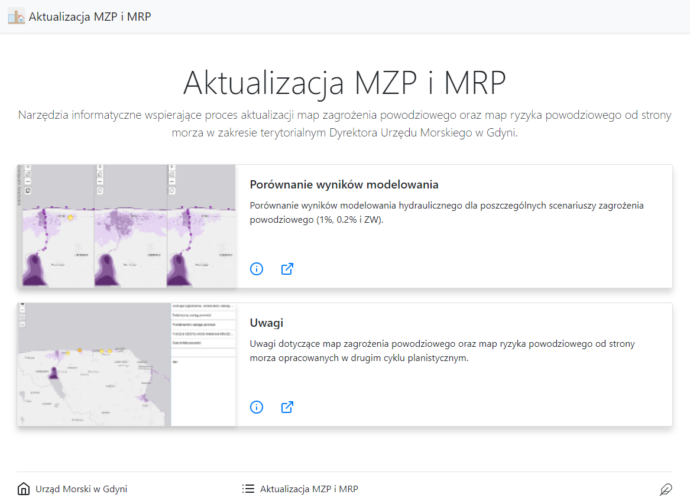

# ArcGIS Portal Landing Page

This application changes [ArcGIS Portal](https://enterprise.arcgis.com/en/portal/) or [ArcGIS Online](https://www.arcgis.com) group into dedicated landing page. Instead of showing all portal elements like links to Gallery or Groups Landing  Page focuses only on your Group. 

This application was inspiredy by [Minimal Gallery](https://github.com/Esri/minimal-gallery) from Esri. I found Minimal Gallery code so overcomplicated that it was easier for me creating new application rather than adding two text elements (group snippet and group description) to existingn Minimal Gallery code. I ended with one HTML file and one TypeScript file + reference to bootstrap.css.

## How to use

1. [Download](https://github.com/KubaSzostak/LandingPage/archive/master.zip)    and put content of this repository on your server
2. Update config.js file
3. If needed use URL parameters 'portalUrl' and 'group'